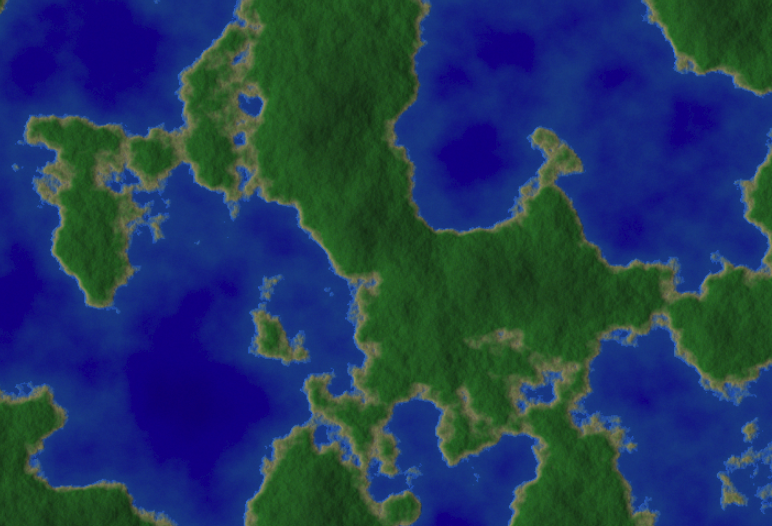

# Noise

Experimenting with noise to generate terrain.

See [live demo here](https://luciopaiva.com/noise).

## How it works

Terrain is generated based on the improved Perlin noise algorithm. Noise is added in a fractal way and the user can adjust it by changing the configured number of octaves.

Terrain colors are chosen according to elevation. A palette is defined in the CSS file, parsed and filled with a linearly-interpolated gradient, contributing to finer detail. A bit of sauce is added to the palette: +/-5% uniformly distributed noise.

Normals are calculated for each terrain point and lighting is added based on that, considering current sun position.

To run the terrain generation, web workers can be used by setting `Threads` to something greater than zero in the control panel.
